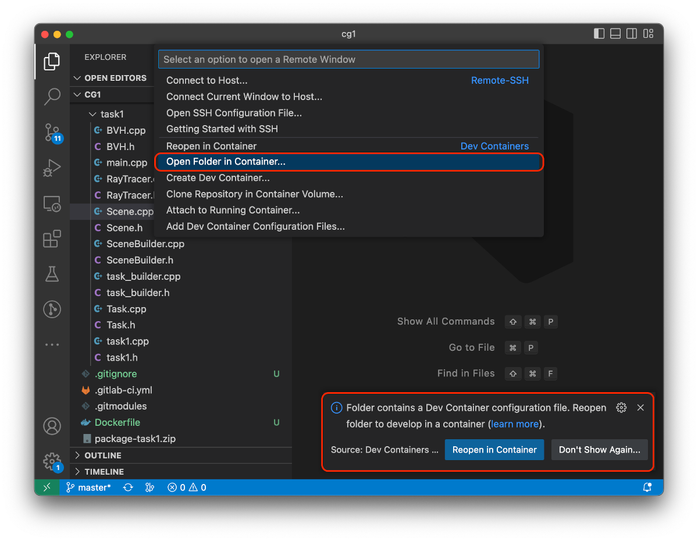

# CV Task 1 

This repository contains the (first) assignments for "Computer Vision" (`710.120`) and "Computergrafik und - vision" (`INH.03130UF`) and "Computer Vision 1" (`DGJ.40300UF`). 
This README provides a brief overview of how to get started and create a submission. We support using [VS Code](https://code.visualstudio.com/download), [Docker](https://docs.docker.com/engine/install/) and native Ubuntu 22.04.2 LTS.

In our test system, we build and run the code on an Ubuntu 22.04.2 LTS (Jammy Jellyfish) machine with the default versions of OpenCV (`4.5.4`), g++ (`11.3.0`) and CMake (`3.22.1`) from the Ubuntu package archive. 
With the help of the Dockerfile and VS Code you can set up the same environment with very little effort. Please note, that in the end the results on our test server count, so make sure you eventually check its results (see below).

## VS Code

If you are using VS Code, you can open this folder and just press `F5` or go to `Run and Debug` and press `Launch CV`. 
VS Code automatically creates the build folders, builds your code and executes it within a debug environment. 
This is enabled by the `.VS Code/launch.json` configuration. 
You can also edit it to launch other tasks by replacing the arguments in `args` (e.g. replace `"tests/lane.json"` with `"tests/highway.json"`):
```json
    ...
    "configurations": [
        {
            "name": "Launch CV",
            "type": "cppdbg",
            "request": "launch",
            "program": "${command:cmake.launchTargetPath}",
            "args": [
                "tests/lane.json"
            ],
            "stopAtEntry": false,
    ...     
```

>Note: You might need to select the active kit (your GCC setup). If VS Code does not prompt you via a popup, there is the possibility to select it status bar at the bottom of the window.

## Using VS Code and Docker with Dev Container

We also provide you with a Dockerfile and a Dev Container environment. 
You just have to install Docker, VS Code and the VS Code extension Dev Containers (`ms-VS Code-remote.remote-containers`) and execute the command `Open Folder in Container...`



The image will now build and a container is started. 
Now you can just run and edit your code just like instructed above.

## Docker (without VS Code)

You can also run everything from the command line within a Docker image. For this, you have to build and tag the image first (within the root folder of the repository):

```bash
docker build -t cv-test-system .
```
>Note: you only have to build the docker image once

Then you can start the container in an interactive console and mount your local directory using the following command: 
```bash
docker run --init --rm -v ${PWD}:/cv1 -it cv-test-system /bin/bash
```
From there on, you can continue to _Compiling and Running from Command Line_.

## Native Ubuntu 22.04.2 LTS

To install the needed packages, just type:
```bash
sudo apt-get install build-essential cmake libopencv-dev
```

## Compiling and Running from Command Line

We use cmake to build our framework. If you are with a shell in the root of your repository, just type:
```bash
# from repopath
cd src/
mkdir build
cd build
cmake ../
make
```

To run your program, just type:
```bash
# from repopath/src/build
cd ../cv/task1/
../../build/cv/task1/cvtask1 tests/<testcase_name>.json
```
where `testcase_name` are within the `tests` folder. 
Only modify the file `algorithms.cpp`, do not modify the file `main.cpp`.

To run all testcases, run the following script: 
```bash
./run_all_x64.sh
```
Our server's CPUs used in our submission do not support AVX instructions, therefore it might be necessary to run a 
test case via
```bash
OPENCV_CPU_DISABLE=AVX2,AVX ../../build/cv/task1/cvtask1 tests/<testcase_name>.json
```
to get the exact same results (and thus, white diffs). However, please note that in any way, the results on submission
system are the ones which count.

## Generate Local Diffs

To generate local diffs between the reference and output images just run the following script: 
```bash
./test_all_x64.sh
```
If you have no permissions to run it, change the permission with the following command: 
```bash
sudo chmod +x test_all_x64.sh
```

## Automatic Testing Pipeline / (Final) Submission

Every push will be compiled and tested in our test system. 
We also store the output and generated images of your program.
As your code will be graded in this testing environment, we strongly recommend that you check that your program compiles and runs as you intended (i.e. produces the same output images).
To view the output and generated images of your program, just click on the `CI/CD tab -> Pipelines`. 
For every commit, which you push into the repository, a test run is created. 
The images of the test runs are stored as artifacts. 
Just click on the test run and then you should see the output of your program. 
On the right side of your screen there should be an artifacts link.

**For a submission you must create a `submission` branch and push your code into this branch. We will only grade solutions that have been pushed to the `submission` branch of your repository, so make sure that you do not forget to create one!**

## Git Basics / Creating the `submission` Branch

The following commands add the local change (of a file, in our case `algorithms.cpp`) in the working directory to 
so-called staging area and create a commit:

```bash
git add <path_to_algorithms.cpp>
git commit -m "I did this and that and enter info about it here here"
```

To push this commit to the server (and make the changes visible in the web interface), you need to `git push`:

```bash
git push origin <branch_name>
```

To create the `submission` branch (and thus make a submission), you can use the following commands from within the root 
directory of this repository:

```bash
git checkout -b submission
git push origin submission
```

The first command creates a new `submission` branch, and the second command pushes this branch onto the remote repository.

Now you will see the submission branch in your gitlab webinterface. **Double check whether it is your final state.**
If you are not familiar with git, you'll find a lot of helpful tutorials online. For example this one has a nice 
visualization helping to understand the core concepts: https://learngitbranching.js.org/.


